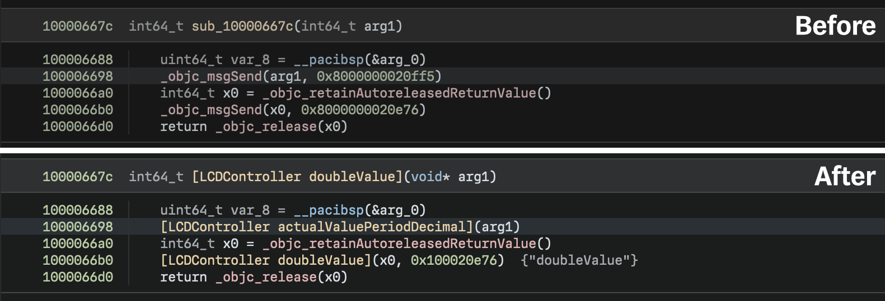

# Objective Ninja

Objective Ninja is a Binary Ninja plugin to assist in reverse engineering
Objective-C code.

Beware, Objective Ninja is still in very early development. There are probably
(almost certainly) bugs, and there is lots of work left to do. If you run into a
problem, please report the issue on GitHub.

## Features

Objective Ninja is still in early development, but already has a handful of
useful features.

### Method Call Cleanup



> Before/after method call cleanup & symbol creation.

Objective Ninja can replace calls to `objc_msgSend` with direct calls to the
relevant method's implementation, as shown above. Also shown is Objective
Ninja's ability to define symbols for class methods using class and selector
data.

### Structure Analysis

As mentioned previously, Objective Ninja parses Objective-C structures found in
the binary. Objective Ninja will also define types for all necessary Objective-C
structures and create data variables for them automatically.

## Limitations

Only the `x86_64` and `arm64` architectures are supported; support for other
architectures is not planned.

## Roadmap

There are numerous other features planned and on the way; see issues marked with
the "feature" tag for more information.

## Build & Installation

Objective Ninja is currently only offered in source code form; to use Objective
Ninja, you will need to build it yourself. The good news is that building it
isn't very difficult.

Clone the Objective Ninja repository, initialize the Binary Ninja API submodule,
then run CMake and build:

```sh
git clone https://github.com/jonpalmisc/ObjectiveNinja.git && cd ObjectiveNinja
git submodule update --init --recursive
cmake -S . -B build -GNinja
cmake --build build
```

Once complete, `libObjectiveNinja` will be available in the build folder; copy
it to your Binary Ninja user plugins folder, then start reversing. :)

See the [Binary Ninja User
Documentation](https://docs.binary.ninja/guide/plugins.html) if you aren't sure
where your user plugins folder is.

## Contributing

Contributions in the form of issues and pull requests are welcome! For
more information, see [CONTRIBUTING.md](CONTRIBUTING.md).

## License

Copyright &copy; 2022 Jon Palmisciano; licensed under the BSD 3-Clause license.
