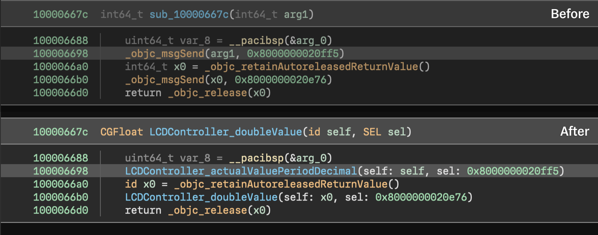

# Objective Ninja

> by [@jonpalmisc](https://twitter.com/jonpalmisc)

Objective Ninja is a Binary Ninja plugin (and workflow) which provides numerous
features to assist in reverse engineering Objective-C code.

*NOTICE: Objective Ninja is a work-in-progress. The important stuff works,
but there are certainly areas for improvement. If you find it to be lacking or
run into any bugs, please file an issue on GitHub.*

## Features



> Objective-C code before and after running the Objective Ninja workflow and
> structure analysis.

Objective Ninja is still in early development, but already has a handful of
useful features:

- **Method Call Cleanup.** When using the Objective Ninja workflow, calls to
  `objc_msgSend` can be replaced with direct calls to the relevant method's
  implementation.

- **Function Name and Type Recovery.** Using class and method information
  embedded in the binary, Objective Ninja can automatically apply names and type
  information to functions for class methods.

- **Structure Markup.** Data variables are automatically created for Objective-C
  structures such as classes and method lists to enable easy navigation.

- **Data Renderers.** Objective Ninja comes with custom data renderers for
  common Objective-C types/patterns, such as tagged and (image-)relative
  pointers.

- **Improved CFString Handling.** CFStrings are analyzed; data variables are
  created and automatically named to make dealing with CFStrings a bit more
  pleasant.

### Core Library

Large parts of Objective Ninja's Objective-C analysis are contained in a
separate library, referred to as the "core library". This library is a plain C++
library and has no dependency on the Binary Ninja API. As such, it can be used
independently outside of the Objective Ninja plugin.

### Limitations

Intel (`x86_64`) and 64-bit ARM (`arm64` or `arm64e`) are the only architectures
supported; support for other architectures is not planned.

## Build & Installation

Objective Ninja is currently only offered in source code form; to use Objective
Ninja, you will need to build it yourself. The good news is that building it
isn't very difficult.

Clone the Objective Ninja repository. The `master` branch should be reasonably
stable, but if you're looking for (slightly) more stability, check out one of
the release tags. Initialize the Binary Ninja API submodule, then run CMake and
build:

```sh
git clone https://github.com/jonpalmisc/ObjectiveNinja.git && cd ObjectiveNinja
git submodule update --init --recursive
cmake -S . -B build -GNinja
cmake --build build
```

Once complete, `libObjectiveNinja` will be available in the build folder; copy
it to your Binary Ninja user plugins folder to install it. See the [Binary Ninja
User Documentation](https://docs.binary.ninja/guide/plugins.html) if you aren't
sure where your user plugins folder is.

### Troubleshooting

```
CMake Error at vendor/api/CMakeLists.txt:58 (find_library):
  Could not find BN_CORE_LIBRARY using the following names: binaryninjacore,
  libbinaryninjacore.so.1
```

If you encounter an error that looks like the one above, you may have to
explicitly set the `BN_CORE_LIBRARY` option when invoking CMake, done as
follows:

```sh
cmake ... -DBN_CORE_LIBRARY="PATH_HERE"
```

However, this should be determined automatically and not have to be
configured by hand.

## Contributing

Contributions in the form of issues and pull requests are welcome! For
more information, see [CONTRIBUTING.md](CONTRIBUTING.md).

## Credits

Objective Ninja is made by [@jonpalmisc](https://twitter.com/jonpalmisc).
However, others have made valuable contributions behind the scenes that aren't
visible by looking at the Git history. Special thanks to
[@noar](https://twitter.com/noarfromspace) and
[@cynder](https://github.com/cxnder), for generously offering their time to help
make sense of the Objective-C ABI and for sharing their knowledge.

## License

Copyright &copy; 2022 Jon Palmisciano; licensed under the BSD 3-Clause license.
